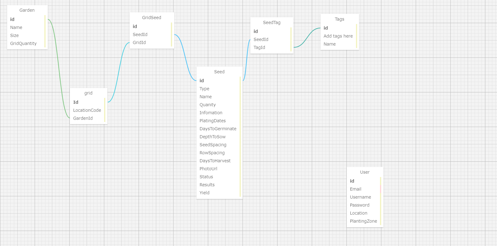

# Garden 
by Chris Ross Davila, Gabriel Tucker<gabrieltucker260@gmail.com>, Kim Robinson<kimmykokonut@gmail.com>, Nikkita Torres<nikkitatorres@yahoo.com>

### Description

This is a project created to help users keep track of their garden. We accomplish this by allowing a to create a garden, assign grids to their garden, and keep track of which seeds are planted in which grid. A user can update the status or state a seed/plant by adding a tag to each individual seed if they wish to. On top of creating all these objects (garden, grids, seeds, tags), a user is able to fully edit and delete these at will.

Over time, we hope to implement:
- A graph where the user can track their garden's results over time
- Data Visualization of planted garden grid
- OpenWeatherApi to track weather and help users determine the ideal conditions for their planting are

### Setup/Installation Requirements

* .NET must be installed. Latest version can be found [here](https://dotnet.microsoft.com/en-us/).
* To run locally on your computer, clone the main branch of this [repository](https://github.com/Gabe9T/GardenTracker).
* In your terminal, navigate to the root folder of this project (GardenAPI.Solution) and run `dotnet restore`.
* Create a new file in the "GardenApi" directory called appsettings.json.
* In `appsettings.json`, enter the following, replacing `USERNAME` and `PASSWORD` to match the settings of your local MySQL server. Replace `DATABASE-NAME` with whatever you would like to name your database.
  
```
{
    "Logging": {
        "LogLevel": {
            "Default": "Information",
            "Microsoft.AspNetCore": "Warning"
        }
    },
    "AllowedHosts": "*",
    "ConnectionStrings": {
        "DefaultConnection": "Server=localhost;Port=3306;database=DATABASE-NAME;uid=USERNAME;pwd=PASSWORD;"
    },
    "JWT": {
        "ValidAudience": "example-audience",
        "ValidIssuer": "example-issuer",
        "Secret": "SecretPassword12"
    }
}
```
* In your terminal, navigate to the "GardenApi" directory and run `dotnet ef database update` to create a local database.
* In GardenTracker/apiclient, enter `npm run dev` in the terminal to launch the webpage.
* Alternatively, to view the project's API end points in a web browser, navigate to the "GardenApi" directory and run `dotnet watch run`.

### Built With


[ASP.NET Core MVC](https://docs.microsoft.com/en-us/aspnet/core/mvc/overview?view=aspnetcore-3.1)
[Entity Framework Core](https://docs.microsoft.com/en-us/ef/core/)




### API Endpoints
*Any mention of {id} below will be a variable that changes with relation to the user's specific object id that autoincrements and cannot be accounted for below*

Account Registration/Login Management:

`POST http://localhost:5000/api/Accounts/register` This will create a request to register and sign a user up for an account.
Here is an example of what the request body will look like:
{
  "email": "string", - User's email
  "userName": "string", - User's username, should match the email used above
  "password": "string" - User's password
}
`POST http://localhost:5000/api/Accounts/SignIn` This will create a request to the database to verify the user's account information exists within the database.
Here is an example of what the request body will look like:
{
  "email": "string",
  "password": "string"
}

Garden Requests:

`GET http://localhost:5000/api/Gardens` This will create a request to return all garden objects.

`GET http://localhost:5000/api/Gardens/{id}` This will create a request to return a specific garden object based on its GardenId property.

`POST http://localhost:5000/api/Gardens` This will add a new garden to our database and requires a request body with an object literal of a garden.
Here is an example of what the request body should look like:
{
  "name": "string",
  "size": "string",
  "gridQty": 0
}

`PUT http://localhost:5000/api/Gardens/{id}` This will create a request to update information within a specific garden by its GardenId.
Here is an example of what the request body should look like:
{
  "gardenId": 0,
  "name": "string",
  "size": "string",
  "gridQty": 0
}

`DELETE http://localhost:5000/api/Gardens/{id}` This will create a request to delete a specific garden by its GardenId.

Grid Requests:

`GET http://localhost:5000/api/Grids` This will create a request to return all grid objects.

`GET http://localhost:5000/api/Grids/{id}` This will return one grid object based on its GridId property.

`POST http://localhost:5000/api/Grids` This will add a new grid to our database and requires a request body with an object literal of a grid.
Here is an example of what the request body should look like:
{
  "locationCode": "string",
  "gardenId": 0,
  "garden": {
    "gardenId": 0,
    "name": "string",
    "size": "string",
    "gridQty": 0
  }
}

`POST http://localhost:5000/api/Grids/AddSeed` This will add a new grid to our database and requires a request body with an object literal of a grid.
Here is an example of what the request body should look like:
{
  "locationCode": "string",
  "gardenId": 0,
  "garden": {
    "gardenId": 0,
    "name": "string",
    "size": "string",
    "gridQty": 0
  }
}

`PUT http://localhost:5000/api/Grids/{id}` This will create a request to update information within a specific grid by its GridId.
Here is an example of what the request body should look like:
{
  "gardenId": 0,
  "name": "string",
  "size": "string",
  "gridQty": 0
}


`DELETE http://localhost:5000/api/Grids/{id}` This will create a request to delete a specific grid by its GridId.

Seed Requests:

`GET http://localhost:5000/api/seeds`This will create a request to return all seed objects.

`GET http://localhost:5000/api/seeds/{id}` This will create a request to return a specific seed object based on its SeedId property.

`POST http://localhost:5000/api/seeds` This will create a request to add a new seed to our database and requires a request body with an object literal of a seed.
Here is an example of what the request body should look like:
{
  "seedId": 0,
  "type": "string",
  "name": "string",
  "quantity": 0,
  "information": "string",
  "plantingDates": "string",
  "daysToGerminate": "string",
  "depthToSow": "string",
  "seedSpacing": "string",
  "rowSpacing": "string",
  "daysToHarvest": 0,
  "photoUrl": "string",
  "status": "string",
  "datePlanted": "string",
  "results": "string",
  "yield": 0
}

`POST http://localhost:5000/api/seeds/AddTag` This will add a new seed to our jointable between seeds and tags, and requires a request body with an object literal of a seed.
Here is an example of what the request body should look like:
{
  "seedId": 0,
  "type": "string",
  "name": "string",
  "quantity": 0,
  "information": "string",
  "plantingDates": "string",
  "daysToGerminate": "string",
  "depthToSow": "string",
  "seedSpacing": "string",
  "rowSpacing": "string",
  "daysToHarvest": 0,
  "photoUrl": "string",
  "status": "string",
  "datePlanted": "string",
  "results": "string",
  "yield": 0
}

`PUT http://localhost:5000/api/seeds/{id}` This will create a request to update information within a specific seed by its SeedId.
Here is an example of what the request body should look like:
{
  "seedId": 0,
  "type": "string",
  "name": "string",
  "quantity": 0,
  "information": "string",
  "plantingDates": "string",
  "daysToGerminate": "string",
  "depthToSow": "string",
  "seedSpacing": "string",
  "rowSpacing": "string",
  "daysToHarvest": 0,
  "photoUrl": "string",
  "status": "string",
  "datePlanted": "string",
  "results": "string",
  "yield": 0
}

`DELETE http://localhost:5000/api/seeds/{id}` This will delete a specific seed object by its SeedId.

Tag Requests:

`GET http://localhost:5000/api/Tags` This will create a request to return a list of all tags.

`GET http://localhost:5000/api/Tags/{id}` This will create a request to return a specific tag object based on its TagId property.

`POST http://localhost:5000/api/Tags` This will add a new tag to our database and requires a request body with an object literal of a tag.
Here is an example of what the request body should look like:
{
  "tagId": 0,
  "nameTag": "string"
}

`POST http://localhost:5000/api/Tags/AddSeed` This will add a new tag to our jointable between seeds and tags, and requires a request body with an object literal of a seed.
Here is an example of what the request body should look like:
{
  "tagId": 0,
  "nameTag": "string"
}

`PUT http://localhost:5000/api/Tags/{id}` This will create a request to update information within a specific tag by its TagId.
Here is an example of what the request body should look like:
{
  "tagId": 0,
  "nameTag": "string"
}
`DELETE http://localhost:5000/api/Tags/{id}` This will delete a specific tag object by its TagId.

### Known Issues/Bugs:

* Currently missing UI

* Name of garden not saving

### License
MIT License

Copyright (c) 2023

Permission is hereby granted, free of charge, to any person obtaining a copy of this software and associated documentation files (the "Software"), to deal in the Software without restriction, including without limitation the rights to use, copy, modify, merge, publish, distribute, sublicense, and/or sell copies of the Software, and to permit persons to whom the Software is furnished to do so, subject to the following conditions:

The above copyright notice and this permission notice shall be included in all copies or substantial portions of the Software.

THE SOFTWARE IS PROVIDED "AS IS", WITHOUT WARRANTY OF ANY KIND, EXPRESS OR IMPLIED, INCLUDING BUT NOT LIMITED TO THE WARRANTIES OF MERCHANTABILITY, FITNESS FOR A PARTICULAR PURPOSE AND NONINFRINGEMENT. IN NO EVENT SHALL THE AUTHORS OR COPYRIGHT HOLDERS BE LIABLE FOR ANY CLAIM, DAMAGES OR OTHER LIABILITY, WHETHER IN AN ACTION OF CONTRACT, TORT OR OTHERWISE, ARISING FROM, OUT OF OR IN CONNECTION WITH THE SOFTWARE OR THE USE OR OTHER DEALINGS IN THE SOFTWARE.
